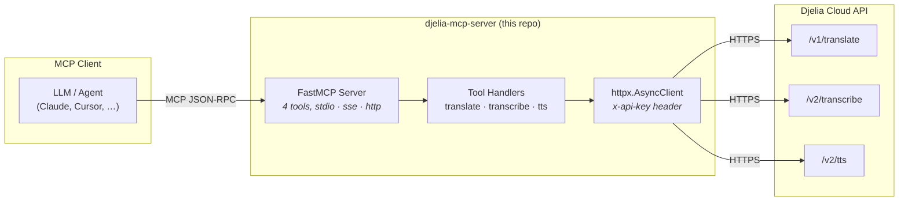
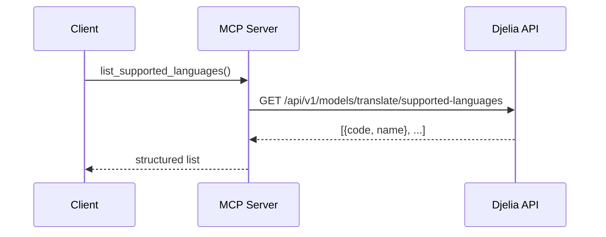
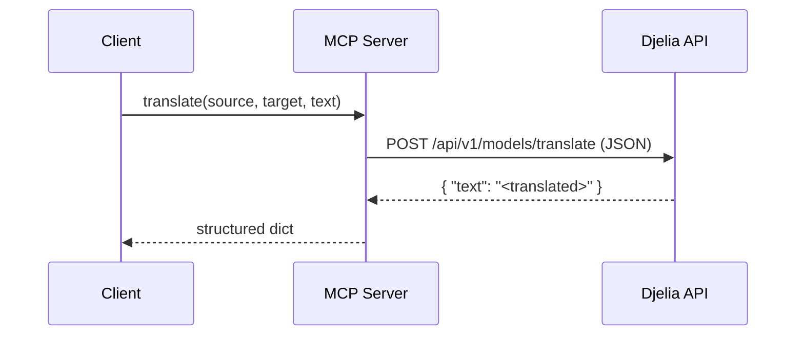
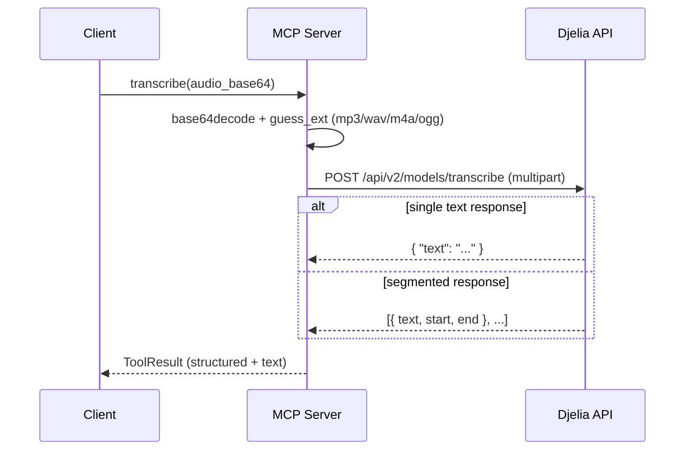
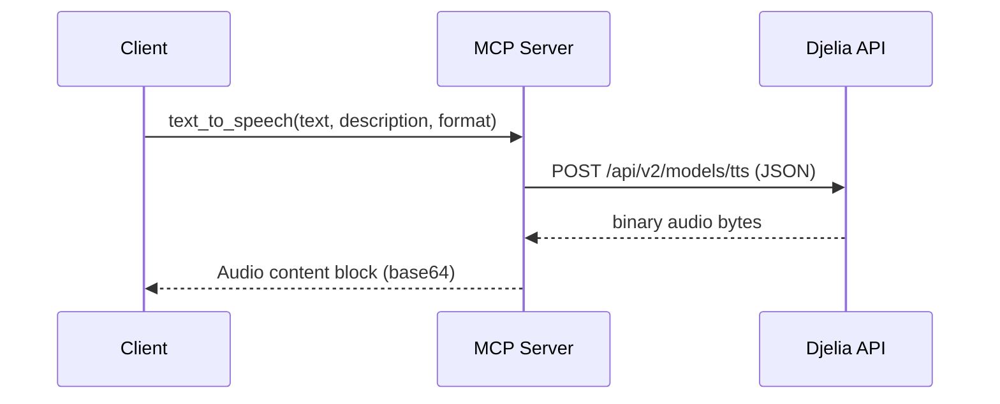
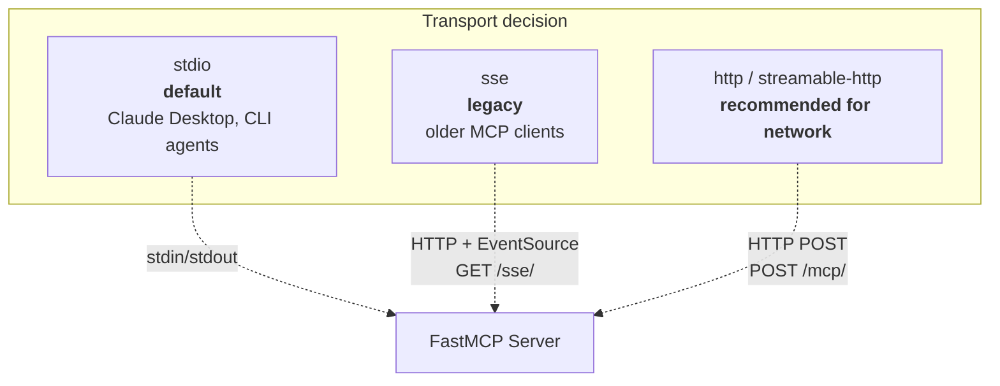

<div align="center">

# 🎙️ Djelia MCP Server

**An [MCP](https://modelcontextprotocol.io) server for [Djelia](https://djelia.cloud) — bring Bambara transcription, translation, and text-to-speech to any LLM.**

Built with [FastMCP](https://gofastmcp.com) v3 · Python 3.11+ · `uv`-managed

</div>

---

## ✨ Overview

[Djelia](https://djelia.cloud) is a linguistic-AI platform focused on African languages — currently **Bambara** (`bam_Latn`), with translation bridging to **French** (`fra_Latn`) and **English** (`eng_Latn`).

This server wraps the Djelia REST API behind the **Model Context Protocol**, so any MCP-compatible client (Claude Desktop, Cursor, Cline, your own agent) can call Djelia's models as native tools — no SDK glue, no HTTP plumbing in your prompt.

### What you get

| # | Tool | Direction | V1 / V2 | Returns |
|---|------|-----------|---------|---------|
| 1 | `list_supported_languages` | — | — | JSON list |
| 2 | `translate` | text → text | v1 | translated text |
| 3 | `transcribe` | audio → text | **v2** | text + segment timing |
| 4 | `text_to_speech` | text → audio | **v2** | audio content block |

> **Design note:** V2 APIs are exposed for transcription and TTS because they supersede V1 (richer voices via `description`, format control). True `/stream` endpoints are omitted — MCP is request/response, so we aggregate the stream inside the tool. Add raw streaming tools only if a use case needs them.

---

## 🏗️ Architecture



**Key design choices**

- **One shared HTTP client** — `x-api-key` header injected once per request; key read from `DJELIA_API_KEY` env var.
- **base64 for audio input** — MCP payloads are JSON; audio bytes travel as base64 so it works across any client. A magic-byte sniffer (`_guess_ext`) recovers the right file extension for the multipart upload.
- **Audio output as a content block** — FastMCP's `Audio` helper returns a proper MCP audio block (clients receive it base64-encoded).

---

## 🔧 How each tool works

### 1 · `list_supported_languages`

Returns the language codes you'll pass to `translate`.



### 2 · `translate`



**Parameters**

| Name | Type | Values |
|---|---|---|
| `source` | enum | `bam_Latn` · `fra_Latn` · `eng_Latn` |
| `target` | enum | `bam_Latn` · `fra_Latn` · `eng_Latn` |
| `text` | string | the text to translate |

### 3 · `transcribe` (Bambara audio → text)

The tool decodes base64 → sniffs the format → uploads as multipart to the V2 transcription endpoint.



### 4 · `text_to_speech` (text → Bambara audio)



**Parameters**

| Name | Type | Values |
|---|---|---|
| `text` | string | text to synthesize |
| `description` | string | voice style, e.g. `"calm male voice, slow pace"` |
| `format` | enum | `mp3` (default) · `wav` · `wav_8k` · `ulaw_8k` |

---

## 🚀 Quickstart

### 1 · Prerequisites

- [uv](https://docs.astral.sh/uv/) installed
- A Djelia API key — get one at <https://console.djelia.cloud>

### 2 · Install dependencies

```bash
git clone <your-repo-url> djelia-mcp-server
cd djelia-mcp-server
uv sync
```

### 3 · Set your API key

```bash
cp .env.example .env
# edit .env:
#   DJELIA_API_KEY=your_key_here
```

The server reads `DJELIA_API_KEY` from the environment. It fails fast with a clear message if the key is missing.

---

## 🌐 Transports

FastMCP supports three transports. Pick the one your client expects.



| Mode | Command | Endpoint |
|---|---|---|
| **stdio** *(default)* | `uv run fastmcp run server.py` | — |
| **sse** *(legacy)* | `uv run fastmcp run server.py -t sse -p 8000` | `http://127.0.0.1:8000/sse/` |
| **http** | `uv run fastmcp run server.py -t http -p 8000` | `http://127.0.0.1:8000/mcp/` |
| **streamable-http** | `uv run fastmcp run server.py -t streamable-http -p 8000` | `http://127.0.0.1:8000/mcp/` |

Override host/port with `--host` / `-p`. See all options: `uv run fastmcp run --help`.

### Direct Python (without the `fastmcp` CLI)

Transport is read from `DJELIA_TRANSPORT` (`stdio` | `sse` | `http`):

```bash
DJELIA_TRANSPORT=sse DJELIA_HOST=127.0.0.1 DJELIA_PORT=8000 uv run python server.py
```

---

## 🤝 Client configuration

### Claude Desktop / Cursor (stdio)

Drop this into your MCP client config:

```json
{
  "mcpServers": {
    "djelia": {
      "command": "uv",
      "args": [
        "run",
        "--directory",
        "/absolute/path/to/djelia-mcp-server",
        "fastmcp",
        "run",
        "server.py"
      ],
      "env": {
        "DJELIA_API_KEY": "your_api_key"
      }
    }
  }
}
```

### Remote / networked client (SSE or HTTP)

Run the server with `-t sse` or `-t http`, then point your client at the endpoint (e.g. `http://your-host:8000/mcp/`).

---

## 🗂️ Project layout

```
djelia-mcp-server/
├── server.py         # all 4 tools + httpx client + transport switch
├── pyproject.toml    # uv project (fastmcp + httpx)
├── .env.example      # DJELIA_API_KEY template
├── .gitignore
└── README.md
```

One file of code — by design. Tools are co-located because they share one client and one concern (calling Djelia).

---

## 🧪 Verifying it works

Smoke-test that all tools register and the server boots on every transport:

```bash
# list registered tools
uv run python -c "import asyncio, server; \
  [print(' -', t.name) for t in asyncio.run(server.mcp.list_tools())]"

# boot a transport
uv run fastmcp run server.py -t sse -p 8000
```

You should see 4 tools listed, and the FastMCP banner with `transport 'sse'` followed by `Uvicorn running`.

---

## 📚 References

- **Djelia API docs** — <https://djelia.cloud/redoc>
- **Djelia console** (get an API key) — <https://console.djelia.cloud>
- **FastMCP** — <https://gofastmcp.com>
- **Model Context Protocol** — <https://modelcontextprotocol.io>

---

## 📝 License

MIT
